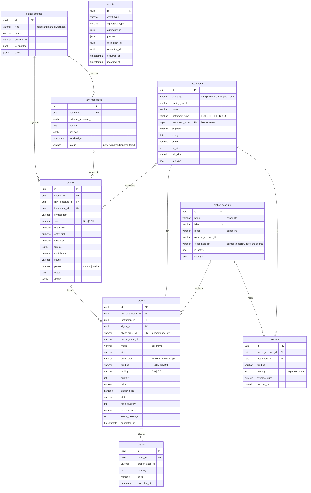

# Database

PostgreSQL 16. The schema is managed by Alembic (`apps/api/alembic`).

| Revision | Adds |
|---|---|
| `0001` | instruments, broker_accounts, signal_sources, raw_messages, signals, orders, trades, positions, events |
| `0002` | `secrets` (name PK, Fernet `ciphertext`), `app_settings` (key PK, JSONB `value`) |
| `0003` | `signals.details` (JSONB parser extras), index `ix_instruments_name_type_expiry` for F&O lookup |

## Conventions

* Primary keys: `UUID` (generated app-side, `uuid4`).
* `created_at` / `updated_at`: `TIMESTAMPTZ`, server default `now()`.
* Prices and money: `NUMERIC(18,4)`. Confidence: `NUMERIC(4,3)` in [0, 1].
* Enumerations: `VARCHAR(32)` plus a named `CHECK` constraint (not native PG enums, so they are easy to evolve).
* Flexible data: `JSONB` (`settings`, `config`, `payload`, `targets`).
* Constraint names follow a deterministic convention (`pk_`, `fk_`, `uq_`, `ck_`, `ix_`), so
  `alembic check` stays clean.

## ERD



Every table except `events` also has `created_at` and `updated_at`.

Standalone tables (no foreign keys):

* `secrets(name PK, ciphertext BYTEA)`: Fernet-encrypted credentials (Telegram API ID/hash/phone/session,
  Kite key/secret/access token, LLM key, admin password hash). The master key lives **outside** the
  database (`MARKETOS_SECRET_KEY` or the key file).
* `app_settings(key PK, value JSONB)`: runtime settings sections `trading`, `parsing`, `auth`.

## Integrity rules

| Table | Constraint |
|---|---|
| instruments | `UNIQUE(exchange, tradingsymbol)`, `UNIQUE(instrument_token)` |
| broker_accounts | `UNIQUE(label)` |
| signal_sources | `UNIQUE(kind, external_id)` |
| raw_messages | `UNIQUE(source_id, external_message_id)`, which deduplicates re-delivered messages |
| signals | `confidence` in [0, 1] |
| orders | `UNIQUE(client_order_id)`, `quantity > 0`, `0 <= filled_quantity <= quantity` |
| trades | `quantity > 0` |
| positions | `UNIQUE(broker_account_id, instrument_id, product)` |

## Delete behaviour

* Deleting a `signal_source` cascades to its `raw_messages` and is blocked while `signals` reference it.
* Deleting an `order` cascades to its `trades`.
* `signals.raw_message_id` and `orders.signal_id` become `NULL` when the referenced row is deleted.
* Instruments and broker accounts referenced by orders cannot be deleted (`RESTRICT`).
* `events` is append-only by convention. The application never updates or deletes rows.

## Migrations

```bash
cd apps/api
uv run alembic upgrade head              # apply
uv run alembic downgrade -1              # roll back one
uv run alembic revision --autogenerate -m "describe change"
uv run alembic check                     # fails if models and migrations diverge
```

After autogenerating, review the file. Alembic emits enum `CHECK` constraints twice: keep the
`op.f("ck_<table>_<name>")` one, delete the bare `name="<name>"` duplicate, and set
`create_constraint=False` on the `sa.Enum(...)` column type (see `0001`).
